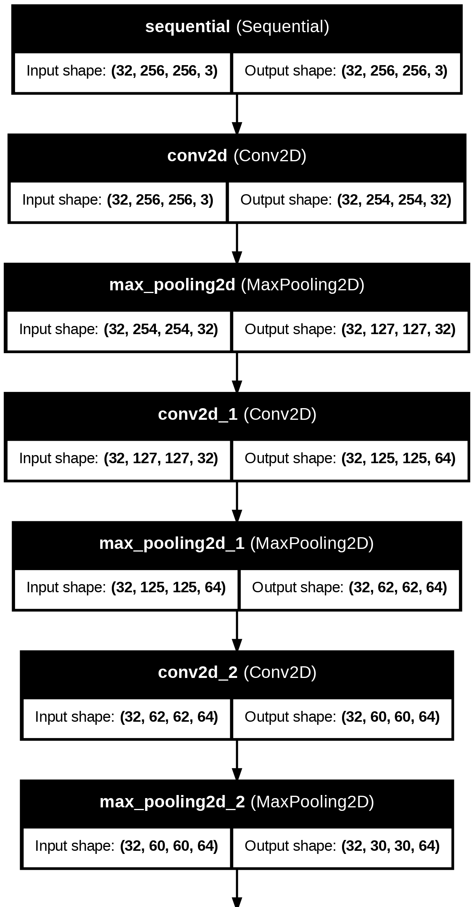
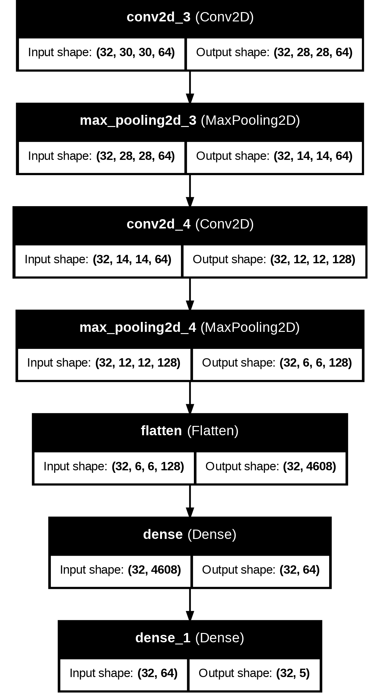
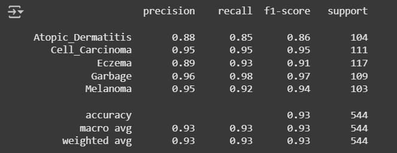
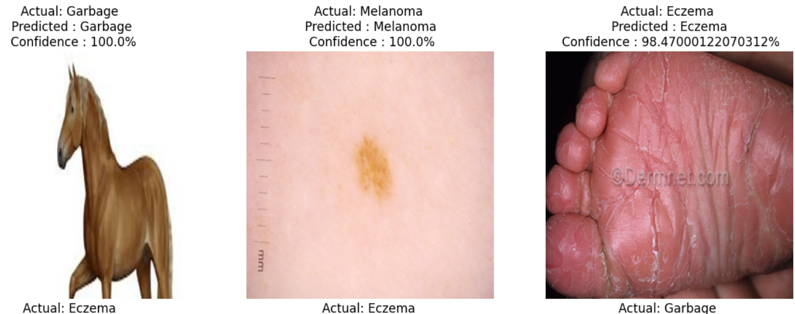
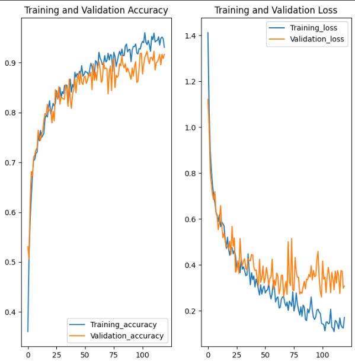

# 🧴 Skin Disease Detection

**Skin Disease Detection** is a deep learning-powered diagnostic system designed to classify common skin conditions from images using a Convolutional Neural Network (CNN). Integrated with a RESTful FastAPI backend, it provides an accessible tool for early screening and awareness.

---

## 📌 Table of Contents

- [📖 Project Overview](#-project-overview)
- [🚀 Functionalities](#-functionalities)
  - [📷 Image Based Diseases Detection](#-image-based-diseases-detection)
- [🎥 Demo Video ](#-demo-video)
- [🛠 Tech Stack](#-tech-stack)
- [🧹 Data Preprocessing](#-data-preprocessing)
- [📌 Model Architecture](#-model-architecture)
- [📈 Evaluation Metrics](#-evaluation-metrics)

---

## 📖 Project Overview

**Skin Disease Detection** aims to assist in the early diagnosis of dermatological conditions using deep learning:
- Users can upload an image of a skin condition.
- The CNN model classifies the image into one of several known diseases (e.g., eczema, psoriasis, acne, ringworm).
- The API returns the predicted disease name along with the confidence score.

This project leverages medical imaging datasets and deep learning to help general users, researchers, and healthcare practitioners.

---

## 🚀 Functionalities

- Deep Learning Classification using CNN
- Networking Package: dio: ^5.4.0
- REST API via FastAPI

### 📷 Image Based Diseases Detection
---
- Endpoint: `POST localhost:8070/predict`
- Input Format

  <table>
  <tr>
    <td></td>
    <td></td>
  </tr>
  <tr>
    <td></td>
    <td></td>
  </tr>
  </table>

- Output Format
  <table>
  <tr>
    <td></td>
    <td></td>
  </tr>
  </table>

  - Detects invalid inputs when the provided image is not related to skin diseases.

---

## 🎥 Demo Video 
[Click here to watch full application](https://drive.google.com/file/d/13IOfhqcKsNX3g138qJMOdt_Nh-9XTfrp/view?usp=sharing)

---

## 🛠 Tech Stack

- **Language:** Python 3.11.7, Dart
- **Libraries:**  TensorFlow, Keras, NumPy 
- **API Framework:** FastAPI
- **Frontend Framework:** Flutter  
- **Server:** Uvicorn  

---

## 🧹 Data Preprocessing

- Image resizing (e.g., 256x256)
- Normalization of pixel values
- Data augmentation: Rotation, Flipping
- Class balancing
- Addition of garbage class

## 📌 Model Architecture

### 🧠 CNN Model Details:
---

- Input Layer: 256x256 RGB image
- Batch Size: 32
- Convolutional Layers: 5 layers with ReLU activation
- MaxPooling after each Convolutional layer
- Fully Connected Layers: One Dense layer with 64 units and ReLU activation
- Output Layer: Softmax activation for multi-class classification
  <table>
  <tr>
    <td></td>
    <td></td>
  </tr>
  </table>
- Optimizer: Adam
- Loss Function: SparseCategoricalCrossentropy(from_logits=False)
- Train-Val-Test Split: 60-20-20

---

## 📈 Evaluation Metrics

- Accuracy: 92.64%
- Precision, Recall, F1-Score:

  
- Model Evaluation:

  
- Training Curves:

  

---

